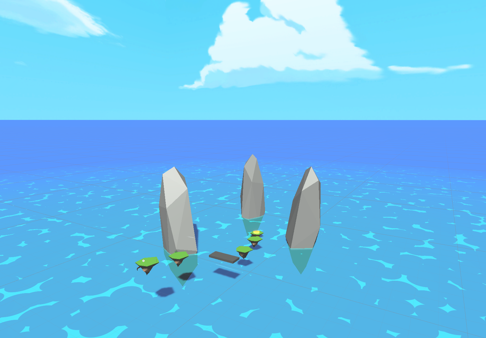
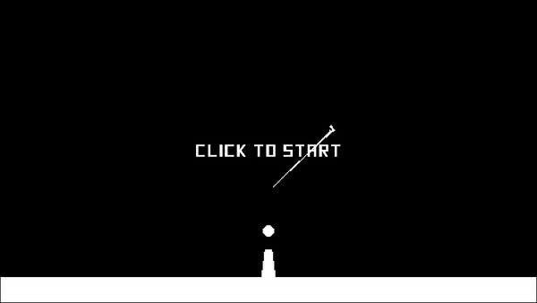
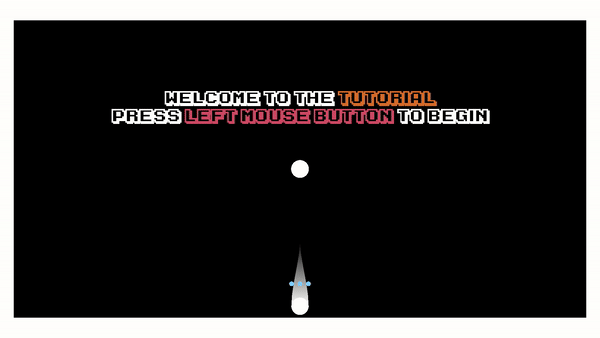

<p align="center"></p>

<h4 align="center">A Place Where Prototypes Proliferate</p>

[]()

---

---

## Purpose

This repository is simply what the title suggest it is. I use this repo to store various Unity-based prototypes I am working on. Feel free to clone this repo and mess with these projects as you like!

---

## Project Overviews:

### Swap Shot

<p align="center"></p>

#### _Is there a tutorial?_

No

#### Purpose:

I created this project to practice producing a short prototype in my some of my free-time off work. This included using blender to make my own 3D models, Adobe Photoshop to hand draw and produce all my own art assets, as well as produce a Quake III Arena style movement system with various improvements to tailor the design to my idea.

<p align="center"></p>

The aesthetic of this project was probably my favourite to design. I knew I wanted to contrast the _difficult_ platforming with a soothing oceanscape reminiscent of the good-ole N64 days with a very visually guiding easy to interpret level design.

Of the prototypes in this repository, I think this is my favourite. Also check out my hand-painted skybox! I'm quite proud of it, try to spot the puppy cloud :)

---

### The Tower

<p align="center"></p>

#### _Is there a tutorial?_

Nuh-uh

#### Purpose:

I created this project after reading the story _The Red Tower_ by Thomas Ligotti - a surreal stream-of-conciousness short story about a peculiar world governed by esoteric rules. I feel that description makes this project sound a bit more exciting that what it really is. The prototype is a simple wave defense game dressed up with tons of _juicy_ particle effects and a three-color design.

I hope to expand this game over time with simple, non-intrusive, game elements to make it stand out a bit more.

---

### Wall Jump

<p align="center"></p>

#### _Is there a tutorial?_

Yes!

<p align="center"></p>

#### Purpose:

I created _Wall Jump_ as a way to test my ability to take various design limitations and create something that felt fun just to control. This gave way to the _unique_ player controller of Wall Jump!

I am hoping to expand this prototype into becoming more of a boss-rush-style game where each level has you fighting in a "bullet-hell" fashion. This would require the player to become adept with the controls and allow for an exciting, sorta kinda, new approach to the "bullet-hell" genre.

---

### Katamari Gameplay

<p align="center"></p>

#### _Is there a tutorial?_

Nope

#### Purpose:

This project was another player controller exercise to mimic - one of my favourite games - Katamari Damacy(塊魂). I wanted the prototype controller to look and handle like a more modern take on the classic arcade roll-em-up series.

This project, as well as Swap Shot taught me a lot about how to traverse Unity's implementation of the NVIDIA PhysX middelware. By that, I mean I spent soooo much time battling the physics engine to do what I needed it to.

---

## Dependencies

All three projects take advantage of the open-source Unity [DOTween library](https://github.com/Demigiant/dotween) for various forms of smooth interpolation. This library really helps add _juice_ at a low implementation cost and is far more performant than using Unity animations most all of the time. (The daisy chaining functionality of this library is just fantastic!)

All three of these projects also use [Cinemachine](https://unity.com/unity/features/editor/art-and-design/cinemachine), which is a fantastic asset for creating more dynamic cameras in Unity. I highly suggest giving it a look if you are tired of constantly adapting Unity's default cameras to do your bidding.

I would also like to give notice to [Roy Stan](https://roystan.net/) for his fantastic article on creating a toon shader. I converted his approach into shader graph, as practice with Shader Graph, for the _Katamari Gameplay_ prototype.

Additionally, shoutout to [Ciro Continisio](https://connect.unity.com/p/zelda-inspired-toon-shading-in-shadergraph)'s article which discussed how to create a custom HLSL lighting node for use in Shader Graph.

---

## Support

If you are looking for support please send a non-spammy looking email to Rilliden@gmail.com. If you are unsure what to write for the title, try something in this format:

```
[Repository Name] <Question>
```

---

## Q&A

### _Q_: Isn't sharing your prototypes publically typically a bad idea?

**A**: Ye', probably!

### _Q_: Why do your assets look so primitive?

**A**: Well sometimes it's a stylistic choice, and other times it is because I enjoy making all my own assets and shaders (when viable). However, this does infact hinder what I can do and how attractive I can make my projects look. I try to make up for this by adding lots of _juice_!

### _Q_: What is up with the Swap Shot prototype's name?

**A**: The original design of the prototype was to create a game that would have you speed running through a level by swapping between various enemies that scatter the level by "shooting your consciousness". However, as I began developing the project, my already limited free time was being devoured by creating assets. So, I put the mechanic on hold until I have the proper time to give its implementation.
